# _Matriz de Resiliencia Climática Territorial_

##

### El territorio cambia

:::: {.columns}

::: {.column .p_small width="42%"}

 

[Idea fuerza]{.mrct-kicker}
[El cambio climático aparece como una combinación de señales.]{.mrct-big}

- Una cuenca puede cambiar en vegetación, agua, nieve, humedad, temperatura y paisaje al mismo tiempo.
- Mirar una sola variable ayuda a describir un síntoma, pero no la condición del sistema.
- La MRCT integra esas señales para reconocer estabilidad, tensión, recuperación o transición.

:::

::: {.column .p_small_m width="5%"}
:::

::: {.column .mrct-image width="52%"}
{fig-align="center" width="100%"}

:::

::::

::: {.notes}
Abrir con Magallanes como territorio extenso, remoto y ambientalmente contrastado. Enfatizar que una anomalía anual o una variable aislada no bastan para entender transición ecosistémica.

:::

##

### ¿Qué es la MRCT?

:::: {.columns}

::: {.column .p_small width="42%"}

 

[Marco de lectura]{.mrct-kicker}
[Una arquitectura para leer cambio ecosistémico territorial.]{.mrct-big}

[**¿Qué es?**]{.mrct-quote}: Una arquitectura de indicadores ecosistémicos por cuenca, organizada como series temporales multivariadas.

[**¿Qué mide?**]{.mrct-quote}: Qué tan lejos está una cuenca de su régimen de referencia, cómo se mueve y qué factores amplifican su presión de transición.

[**¿Para qué sirve?**]{.mrct-quote}: Para priorizar dónde mirar, qué validar en terreno y qué hipótesis territoriales discutir antes de tomar decisiones.

:::

::: {.column .p_small_m width="5%"}
:::

::: {.column width="52%"}
 

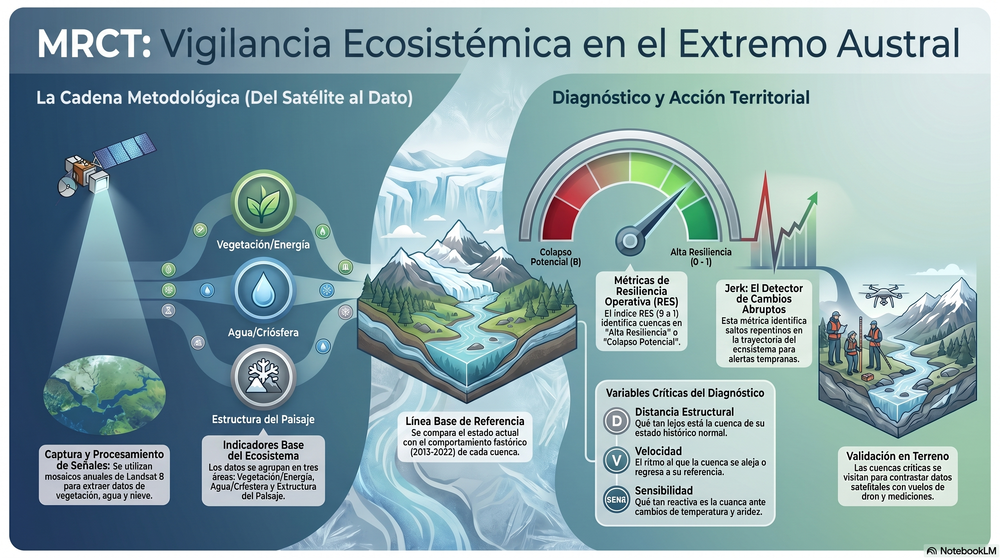{fig-align="center" width="92%"}

<!-- > La matriz no es una caja negra: cada resultado final puede abrirse en sus componentes. -->

:::

::::

::: {.notes}
Presentar la MRCT como un sistema de preguntas trazables. Evitar decir que entrega una sentencia única o un ranking final cerrado.

:::

# Territorio y unidad de análisis

##

### Área de estudio: Región de Magallanes

:::: {.columns}

::: {.column .p_small width="42%"}

 

[Área de estudio]{.mrct-kicker}
[Un territorio extenso, remoto y ambientalmente contrastado.]{.mrct-big}

- La MRCT se aplica en la Región de Magallanes y de la Antártica Chilena.
- El análisis se concentra en el sector sudamericano y sus cuencas hidrográficas.
- La heterogeneidad regional exige una lectura comparativa, espacial y trazable.

:::

::: {.column .p_small_m width="5%"}
:::

::: {.column .mrct-image width="52%"}
<!-- 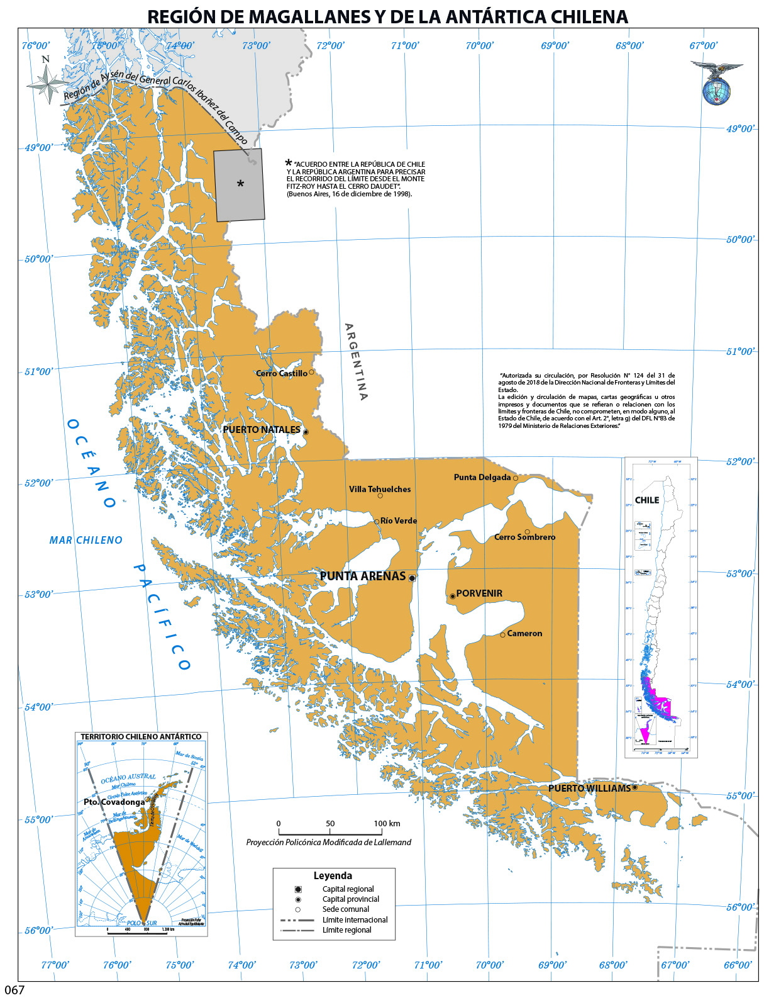{fig-align="center" width="92%"} -->
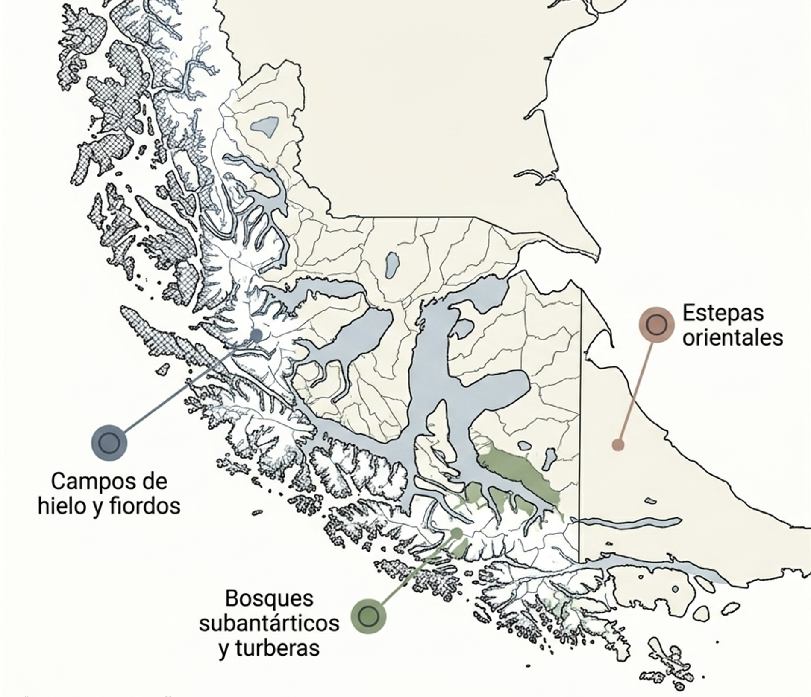{fig-align="center" width="92%"}

:::

::::

::: {.notes}
Antes de entrar a la matriz, ubicar el territorio. Magallanes combina fiordos, estepa, bosques subantárticos, turberas, lagos, nieve y glaciares; por eso una misma señal satelital puede tener lecturas distintas según el contexto ecológico.

:::

##

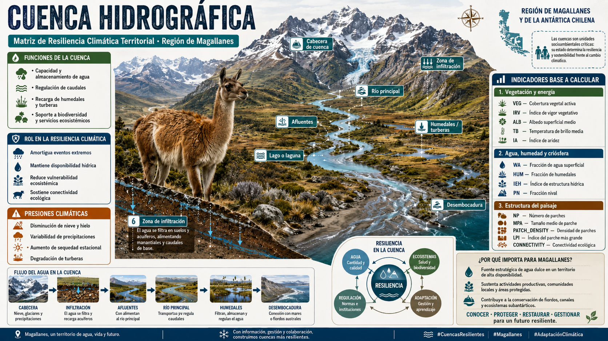{fig-align="center" width="1600"}

##

### Unidad territorial: cuenca hidrográfica

:::: {.columns}

::: {.column .p_small width="42%"}

 

[Unidad de análisis]{.mrct-kicker}
[La cuenca integra procesos físicos, hídricos y ecosistémicos.]{.mrct-big}

- La matriz no trabaja sobre píxeles aislados ni sobre límites administrativos.
- Cada cuenca resume vegetación, agua, humedad, nieve, temperatura y estructura del paisaje.
- Esta unidad permite comparar cambios año a año con sentido territorial.

:::

::: {.column .p_small_m width="5%"}
:::

::: {.column .mrct-image width="52%"}
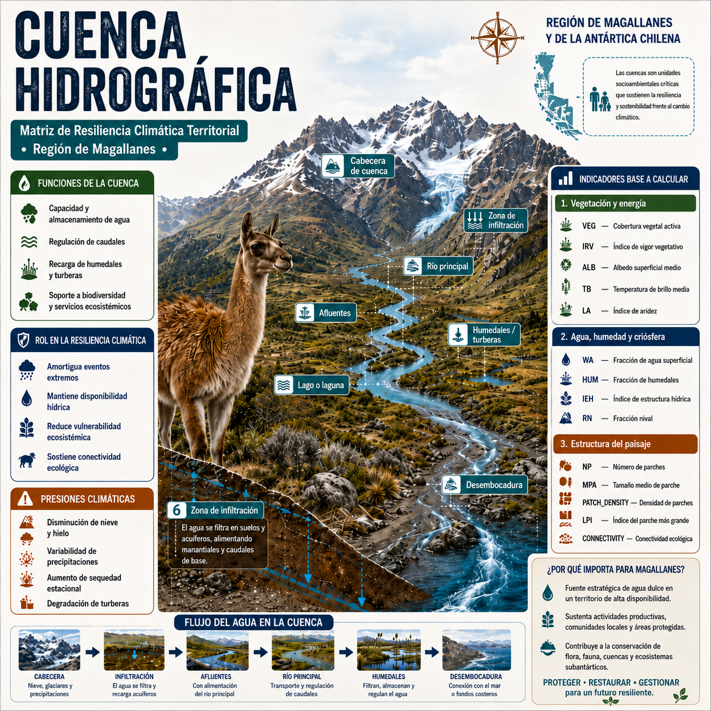{fig-align="center" width="92%"}

:::

::::

::: {.notes}
Explicar que la cuenca funciona como unidad funcional: conecta relieve, escorrentía, cobertura terrestre, criósfera y presencia humana. Después de esta lámina recién tiene sentido hablar de indicadores por cuenca y año.

:::

# Construcción de la MRCT

## {background-image="images/infografia_mrct_hor_w.png"  background-size="1200px" background-position="center"}

##

### Arquitectura del modelo

:::: {.columns}

::: {.column .p_small width="38%"}
[Arquitectura MRCT]{.mrct-kicker}
[Cada etapa toma el producto anterior y agrega una capa de interpretación.]{.mrct-big}

- De señal satelital a indicadores territoriales.
- De indicadores a estado ecosistémico.
- De estado a trayectoria, contexto y sensibilidad.
- De trayectoria integrada a prioridad territorial.

:::

::: {.column width="58%"}

{fig-align="center" width="95%"}

:::

::::

::: {.notes}
Usar esta lámina como mapa de navegación. No explicar todavía cada fórmula; sólo dejar claro que el flujo transforma observación remota en una lectura territorial reproducible.

:::

##

### Paso 0 | Insumos satelitales e índices espectrales

:::: {.columns}

::: {.column .p_small width="45%"}
[Datos de entrada]{.mrct-kicker}
[Esta etapa ya fue levantada y no se profundiza en esta presentación.]{.mrct-big}

- **Landsat 8** entrega señal óptica y térmica comparable.
- Cada año se resume en mosaicos robustos para **2013-2025**.
- Los índices traducen reflectancia en vegetación, agua, nieve, aridez, albedo y temperatura.
- Para este cálculo, los insumos ya llegan limpios, alineados y listos para agregarse por cuenca.

:::

::: {.column .p_small_m width="5%"}
:::

::: {.column .mrct-image width="50%"}
{fig-align="center" width="92%"}

:::

::::

::: {.notes}
Explicar que este paso es condición de entrada. El levantamiento, limpieza y construcción de mosaicos satelitales ocurrió en una sección metodológica aparte; aquí sólo se declara qué señales entran a la MRCT.

:::

##

### Paso 1 | Indicadores base

:::: {.columns}

::: {.column .p_small width="40%"}
[Traducción territorial]{.mrct-kicker}
[Los índices dejan de ser pixeles y pasan a ser señales por cuenca.]{.mrct-big}

- Agua, humedad y criósfera describen disponibilidad hídrica y nieve.
- Estructura del paisaje muestra fragmentación y continuidad ecológica.
- Vegetación y energía capturan cobertura, vigor, aridez y carga térmica.
- Cada cuenca queda con una serie anual comparable.

:::
::: {.column .p_small_m width="10%"}
:::
::: {.column .mrct-image width="50%"}
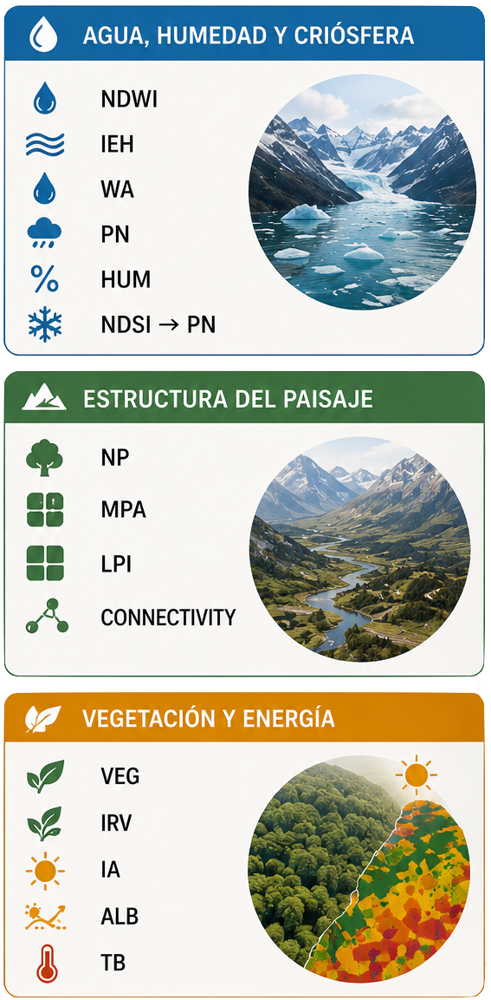{fig-align="right" width="100%"}

:::

::::

::: {.notes}
Conectar esta lámina con la fase 1 de la infografía. La idea es que los índices espectrales todavía son señal física; los indicadores base ya son métricas con significado territorial.

:::

##

### Paso 2 | Vector de estado ecosistémico

:::: {.columns}

::: {.column .p_small width="40%"}
[Estado ecosistémico]{.mrct-kicker}
[Cada cuenca-año se representa como una posición del sistema.]{.mrct-big}

- El vector integra los indicadores base en una estructura común.
- Permite comparar cuencas y años sin mirar variables aisladas.
- La matriz completa contiene **21.040 cuencas x 13 años**.

$$
\mathbf{T} \in \mathbb{R}^{N \times Y \times d}
$$

`N`: cuencas · `Y`: años · `d`: indicadores del estado ecosistémico.

:::

::: {.column .p_small_m width="10%"}
:::

::: {.column .mrct-image width="50%"}
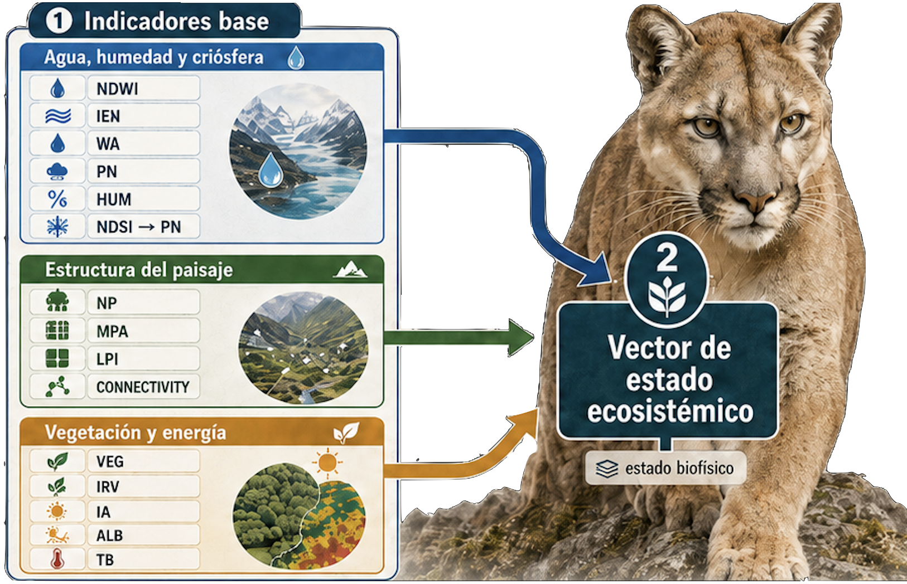{fig-align="center" width="80%"}

:::

::::

::: {.notes}
Mencionar que el vector no borra los indicadores: los ordena en una sola representación del sistema. La clave es que el estado ecosistémico se vuelve medible y comparable.

:::

##

### Paso 3 | Dominio de referencia y trayectoria temporal

:::: {.columns}

::: {.column .p_small width="42%"}
[Física del cambio]{.mrct-kicker}
[Primero se mide la distancia `D`; luego se calcula cómo cambia en el tiempo.]{.mrct-big}

- Línea base: **2013-2022**.
- `D` mide alejamiento respecto del dominio de referencia.
- `V`, `A` y `J` describen la trayectoria de esa distancia.
- La trayectoria separa estabilidad, recuperación y transición activa.

$$
D(\mathbf{x}) =
\frac{
\sqrt{(\mathbf{x} - \boldsymbol{\mu})^\top \hat{\Sigma}^{-1}(\mathbf{x} - \boldsymbol{\mu})}
}{\sqrt{d}}
$$

$$
V_t = D_t - D_{t-1}
$$
$$
A_t = V_t - V_{t-1}
$$
$$
J_t = A_t - A_{t-1}
$$

`D`: distancia al dominio · `V`: velocidad · `A`: aceleración · `J`: cambio brusco de la aceleración.

:::

::: {.column .p_small_m width="5%"}
:::

::: {.column .mrct-image width="52%"}
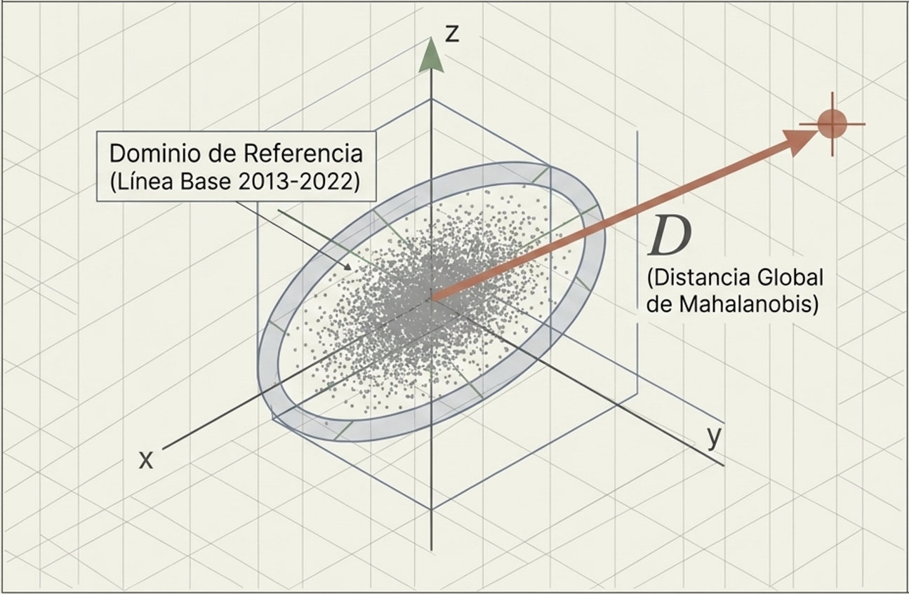{fig-align="center" width="100%"}

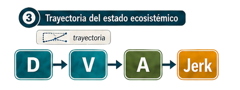{fig-align="center" width="60%"}

:::

::::

::: {.notes}
Explicar que la trayectoria no existe sin la distancia `D`: primero se define el dominio de referencia y después se calculan diferencias anuales. Dos cuencas con igual distancia actual no significan lo mismo si una se recupera y otra se aleja rápido.

:::

##

### Paso 4 | Integración espacial

:::: {.columns}

::: {.column .p_small width="40%"}
[Contexto territorial]{.mrct-kicker}
[Una cuenca no se interpreta aislada: importa su vecindario.]{.mrct-big}

- El dominio global compara con la referencia regional.
- El dominio local compara con las cuencas vecinas.
- KNN usa **8 vecinos** y pesos por distancia.

<!-- $$ -->
<!-- \bar{D}_{local,i,t} = -->
<!-- \sum_{j \in N_k(i)} \tilde{w}_{ij} D_{j,t} -->
<!-- $$ -->
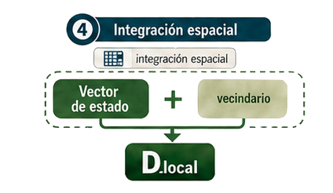{fig-align="center" width="100%"}
<!-- - **Global bajo + local bajo:** condición cercana y coherente. -->
<!-- - **Global alto + local bajo:** señal regional compartida. -->
<!-- - **Global bajo + local alto:** anomalía local. -->
<!-- - **Global alto + local alto:** caso prioritario de revisión. -->

:::

::: {.column .p_small_m width="10%"}
:::

::: {.column width="50%"}

 

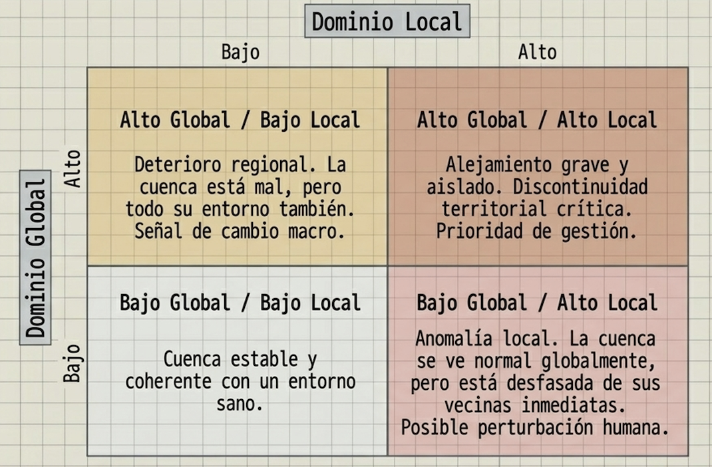{fig-align="center" width="100%"}

:::

::::

::: {.notes}
El dominio local ayuda a evitar conclusiones rápidas. Una cuenca crítica rodeada de cuencas críticas sugiere proceso extendido; una cuenca crítica aislada pide revisión focalizada.

:::

##

### Paso 5 | Sensibilidad climática

:::: {.columns}

::: {.column .p_small width="42%"}
[Reactividad del sistema]{.mrct-kicker}
[`SENS` estima cuánto responde el dominio ante condiciones climáticas.]{.mrct-big}

$$
SENS_i =
\frac{
\sqrt{
\beta_{\text{IA},i}^{2}
+ \beta_{\text{ALB},i}^{2}
+ \beta_{\text{TB},i}^{2}
}
}{
\sigma_{D,i} + 10^{-9}
}
$$

`beta`: respuesta del dominio a cada forzante · `sigma_D`: variabilidad propia de la cuenca.

- IA: aridez; ALB: albedo; TB: temperatura de brillo.
- Sensibilidad alta no significa peor estado: significa mayor reactividad.

:::

::: {.column width="52%"}

 

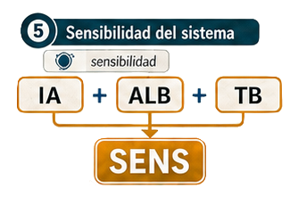{fig-align="center" width="500"}

:::

::::

::: {.notes}
Recalcar que sensibilidad mide reactividad, no diagnóstico final. Cobra sentido cuando se combina con distancia, trayectoria y contexto espacial.

:::

##

### Paso 6 | Síntesis: potencial de transición y resiliencia

:::: {.columns}

::: {.column .p_small width="42%"}
[Síntesis territorial]{.mrct-kicker}
[El resultado combina estado, movimiento, sensibilidad y contexto.]{.mrct-big}

- `PT` alto: mayor propensión de transición.
- `RES` alta: menor presión de transición.
- `RES` baja: mayor vulnerabilidad operativa dentro de la MRCT.

$$
PT_{i,t} =
D_{i,t}
\cdot
\left(1 + |V_{i,t}|\right)
\cdot
\left(1 + \alpha \cdot SENS_i\right)
\cdot
\left(1 + \beta_{local} \cdot D_{local,i,t}\right)
$$

$$
RES_{i,t} = \frac{1}{1 + PT_{i,t}}
$$

`D`: alejamiento · `|V|`: intensidad del cambio · `SENS`: reactividad · `D_local`: presión o contraste espacial.

:::

::: {.column .p_small_m width="5%"}
:::

::: {.column .mrct-image width="52%"}

 
 

{fig-align="center" width="100%"}

<!-- 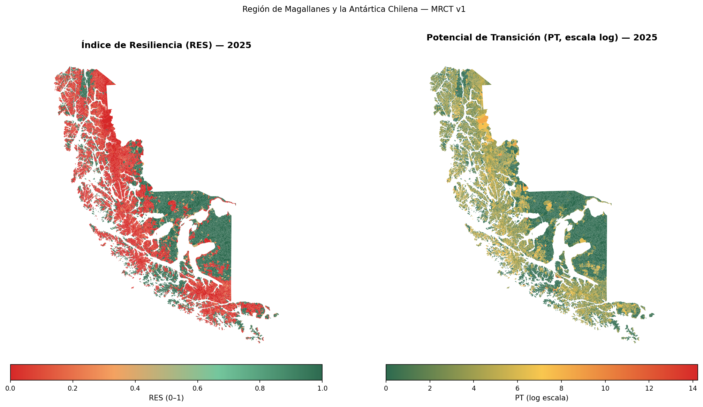{fig-align="center" width="100%"} -->

:::

::::

::: {.notes}
Esta es la lámina de cálculo más importante. Mostrar la lógica antes que la fórmula: lejos de referencia, moviéndose rápido, sensible y en entorno presionado aumenta PT.

:::

# Interpretación de resultados

##

### Cómo leer los resultados

:::: {.columns}

::: {.column .p_small width="42%"}
[Nivel + dirección]{.mrct-kicker}
[No todas las cuencas con baja resiliencia significan lo mismo.]{.mrct-big}

- `RES_STATE` resume nivel: alta, media, baja o colapso potencial.
- `RES_TYPE` agrega dirección: estable, tensionada, recuperación, degradación activa o transición.
- La matriz ordena evidencia y preguntas, no reemplaza validación territorial.

:::

::: {.column .mrct-image width="52%"}
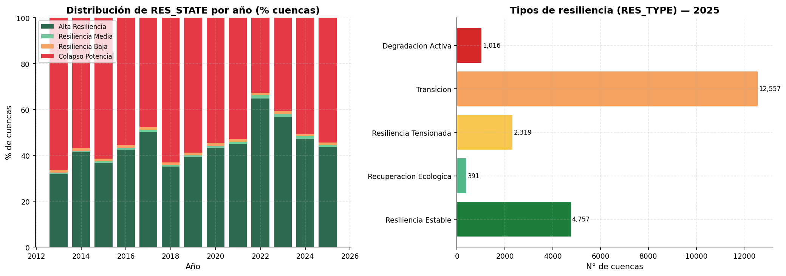{fig-align="center" width="100%"}

:::

::::

::: {.notes}
Evitar decir “peores cuencas” como lectura única. Usar “cuencas prioritarias para revisión” porque el resultado puede tener trayectorias distintas.

:::

##

### Resultados 2025: lectura regional y comunal

:::: {.columns}

::: {.column .p_small width="42%"}
[Magallanes 2025]{.mrct-kicker}
[La señal regional es heterogénea y polarizada.]{.mrct-big}

- Mediana regional de `RES`: **0,094**.
- **43,7%** de cuencas en alta resiliencia.
- **54,5%** de cuencas en colapso potencial.
- Punta Arenas tiene mediana alta, pero fuerte heterogeneidad interna.

:::

::: {.column .mrct-image width="52%"}
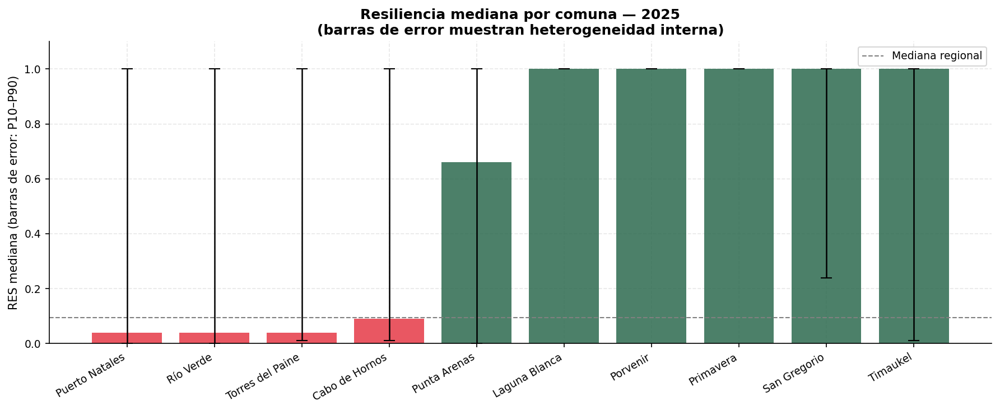{fig-align="center" width="100%"}

[La comparación comunal debe leerse junto con mapas y percentiles.]{.mrct-caption}

:::

::::

::: {.notes}
Usar los números como anclajes, no como centro de la lámina. La conclusión importante es que el promedio no basta.

:::

##

### Síntesis visual 2025

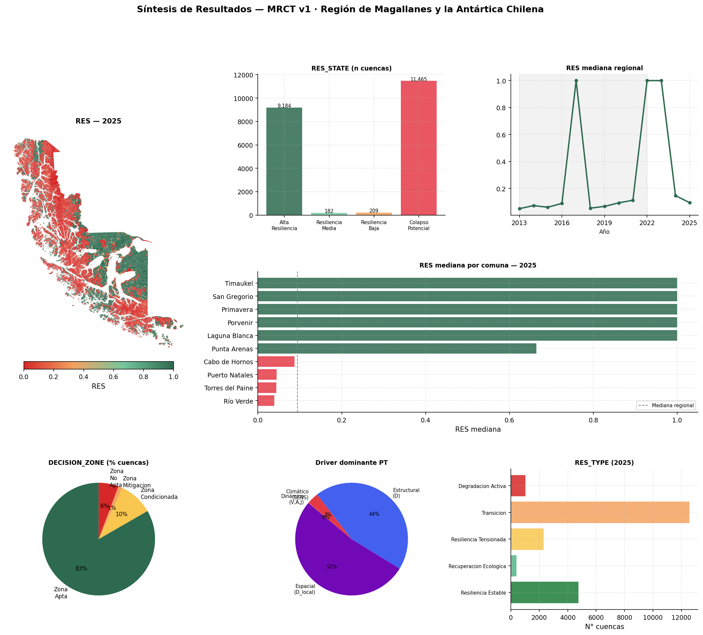{fig-align="center" width="96%"}

::: {.notes}
Usar esta lámina como pausa visual para recapitular. Conectar distribución regional, componentes y lectura comunal.

:::

##

### Mapa interactivo: Punta Arenas

<iframe class="mrct-map-frame" src="maps/p_arenas.html"></iframe>

::: {.notes}
Usar el mapa como lámina de exploración. La idea es ubicar espacialmente cuencas, contrastes internos y zonas candidatas para validación, no leerlo como una imagen estática.

:::

# Aplicación territorial: validación en terreno

##

### Del modelo al terreno: ¿dónde validar?

:::: {.columns}

::: {.column .p_small width="42%"}
[Trabajo de campo]{.mrct-kicker}
[La prioridad no es “la peor cuenca”: es la cuenca que formula una mejor pregunta de validación.]{.mrct-big}

- Se buscan cuencas con señal fuerte y posibilidad real de observación.
- El jerk detecta cambios abruptos que conviene revisar en terreno.
- El ranking combina `J`, `PT`, `RES`, `D_local`, `SENS` y accesibilidad.
- La salida es una lista de candidatas, no una ruta final.

:::

::: {.column .mrct-image width="52%"}
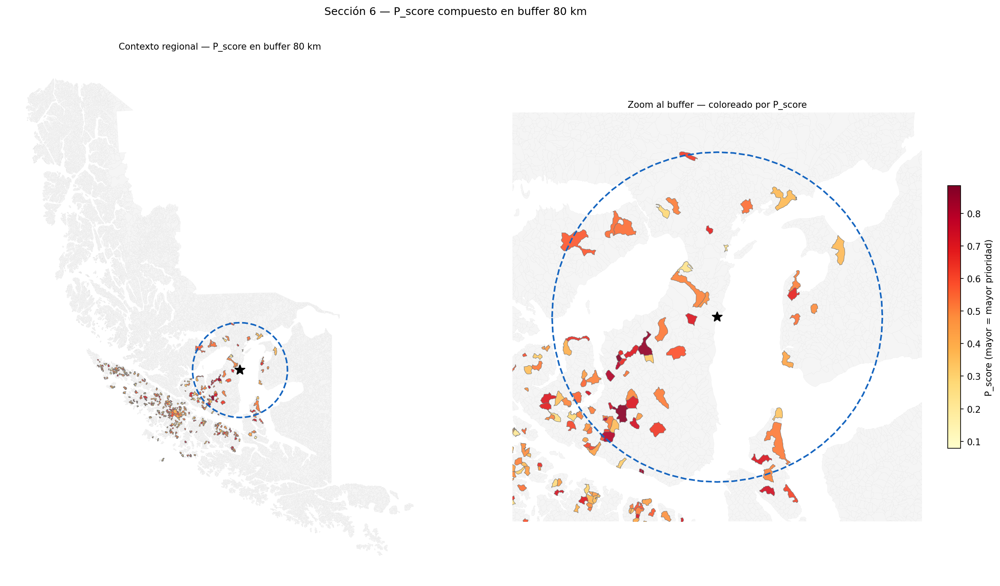{fig-align="center" width="100%"}

:::

::::

::: {.notes}
Explicar que el ranking ordena preguntas. La validación debe revisar accesos, permisos, seguridad, propiedad, clima y conocimiento local antes de fijar campaña.

:::

##

### Punta Arenas: cuencas prioritarias

:::: {.columns}

::: {.column .p_small width="42%"}
[Entorno operacional]{.mrct-kicker}
[El foco es ubicar cuencas visitables con señales ecosistémicas relevantes.]{.mrct-big}

- Área de búsqueda: comuna y entorno operacional de Punta Arenas.
- Criterio usado: **80 km + jerk >= p90 anual**.
- Resultado: **364 cuencas calificadas** y top 10 por `P_score`.
- El top 10 mezcla intensificación y reversión: cada caso exige una hipótesis de terreno distinta.

:::

::: {.column .mrct-image width="52%"}
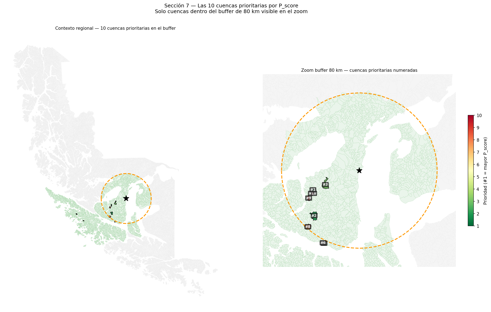{fig-align="center" width="100%"}

:::

::::

::: {.notes}
Recalcar que el mapa ayuda a pasar desde un ranking tabular a una pregunta espacial: qué cuenca, qué acceso, qué observar, qué hipótesis validar y qué alternativa usar si falla el terreno.

:::

##

### Puertos y terminales: criterio estratégico de validación

:::: {.columns}

::: {.column .p_small width="42%"}
[Capa de apoyo]{.mrct-kicker}
[La cercanía a terminales ayuda a priorizar dónde levantar línea base territorial.]{.mrct-big}

- Se revisan buffers de **50 km** alrededor de terminales marítimos.
- Terminales: **Muelle Laredo**, **Cabo Negro** y **San Gregorio**.
- La pregunta de terreno es preventiva: ¿qué cuencas cercanas a infraestructura estratégica ya muestran cambios abruptos?
- Esta capa complementa el ranking, no reemplaza la validación ambiental.

:::

::: {.column .mrct-image width="52%"}
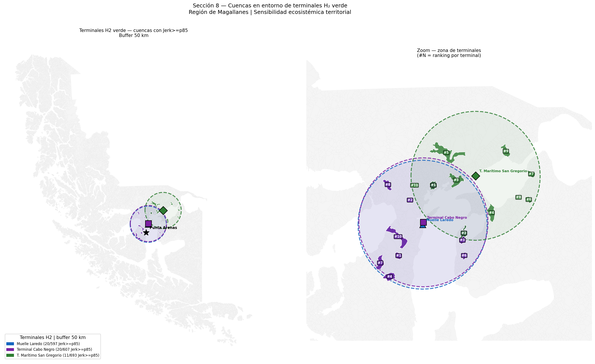{fig-align="center" width="100%"}

:::

::::

::: {.notes}
Presentar puertos/terminales como un criterio para ordenar trabajo de campo y línea base, no como diagnóstico de impacto. Laredo y Cabo Negro comparten señales por proximidad; San Gregorio abre otra zona del Estrecho.

:::

##

### Mapa interactivo: cuencas próximas a puertos

<iframe class="mrct-map-frame" src="maps/puertos.html"></iframe>

::: {.notes}
Usar este mapa para explorar las cuencas dentro de buffers de 50 km alrededor de terminales marítimos. La lectura es estratégica: estos puntos funcionarían como nodos de distribución de hidrógeno verde hacia otras regiones, por lo que conviene identificar cuencas cercanas con señales de baja resiliencia, jerk elevado o necesidad de línea base territorial antes de cualquier intervención.

:::

# Uso y cierre

##

### ¿Qué tenemos?

:::: {.columns}

::: {.column .p_small width="40%"}
[Lo que llevamos]{.mrct-kicker}
[La MRCT ya tiene una primera versión funcional.]{.mrct-big}

- Primera versión de la **Matriz de Resiliencia Climática Territorial**.
- Librería Python de alto nivel para calcular indicadores y componentes de la matriz.
- Resultados regionales, comunales y casos prioritarios para Punta Arenas.
- Libro digital para documentar metodología, decisiones técnicas y evidencia.

<https://cit-uai.github.io/Book-MRCT/>

:::
::: {.column .p_small_m width="10%"}
:::
::: {.column .mrct-image width="50%"}
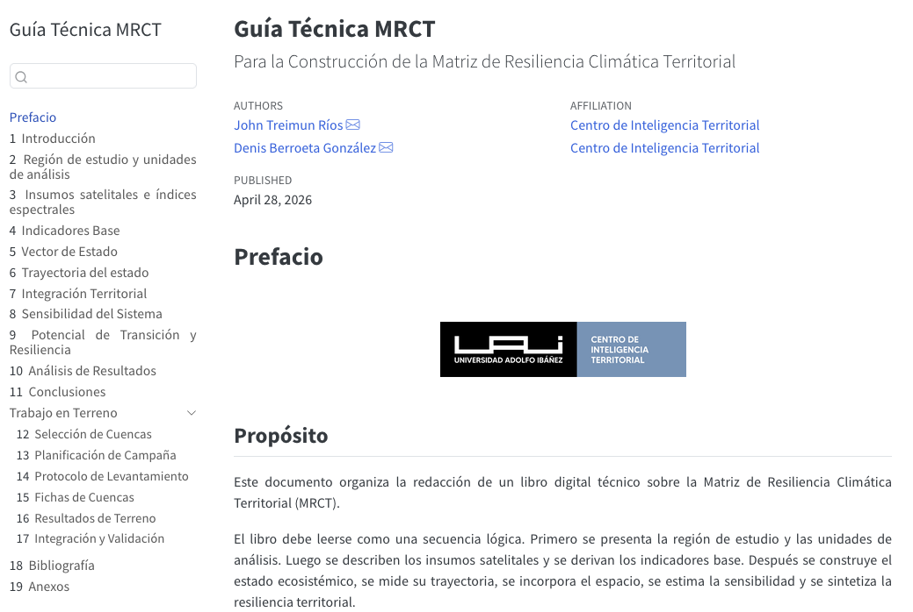{fig-align="center" width="100%"}

:::

::::

::: {.notes}
Presentar esta lámina como estado de avance. Ya existe una versión funcional de la matriz, un pipeline técnico y un libro digital donde se documenta el método y se irá registrando evidencia.

:::

##

### ¿Qué falta?

:::: {.columns}

::: {.column .p_small width="45%"}
[Lo que sigue]{.mrct-kicker}
[El siguiente paso crítico es validar en terreno.]{.mrct-big}

- Revisar cuencas con señales de transición, baja resiliencia o jerk elevado.
- Levantar evidencia territorial en cuencas prioritarias y zonas próximas a terminales.
- Registrar hallazgos, fotografías, observaciones y fichas de validación.
- Actualizar el libro digital con evidencia de campo y ajustes metodológicos.

:::

::: {.column .p_small_m width="5%"}
:::

::: {.column .mrct-image width="50%"}
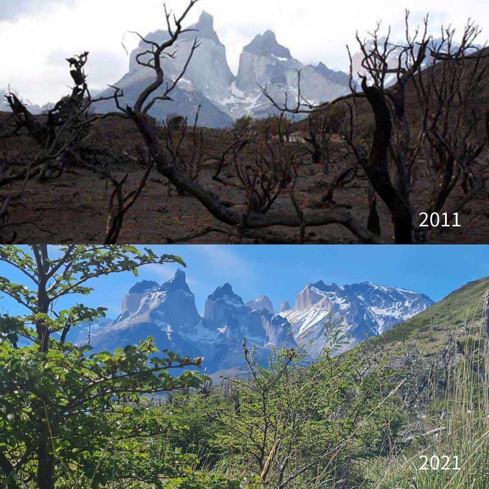{fig-align="center" width="100%"}

:::

::::

::: {.notes}
Enfatizar que lo pendiente no es sólo calcular más, sino comprobar si las señales detectadas corresponden a procesos territoriales observables. Esta validación debe producir fichas, fotografías, notas de terreno y ajustes metodológicos.

:::

##

### ¿Para qué sirve la MRCT?

:::: {.columns}

::: {.column .p_small width="42%"}
[Uso operativo]{.mrct-kicker}
[Transforma datos en preguntas territoriales accionables.]{.mrct-big}

- Identificar cuencas prioritarias para revisión.
- Separar procesos regionales de anomalías locales.
- Reconocer degradación activa, recuperación y transición.
- Orientar terreno, monitoreo y conversación técnica.

:::

::: {.column .mrct-image width="52%"}
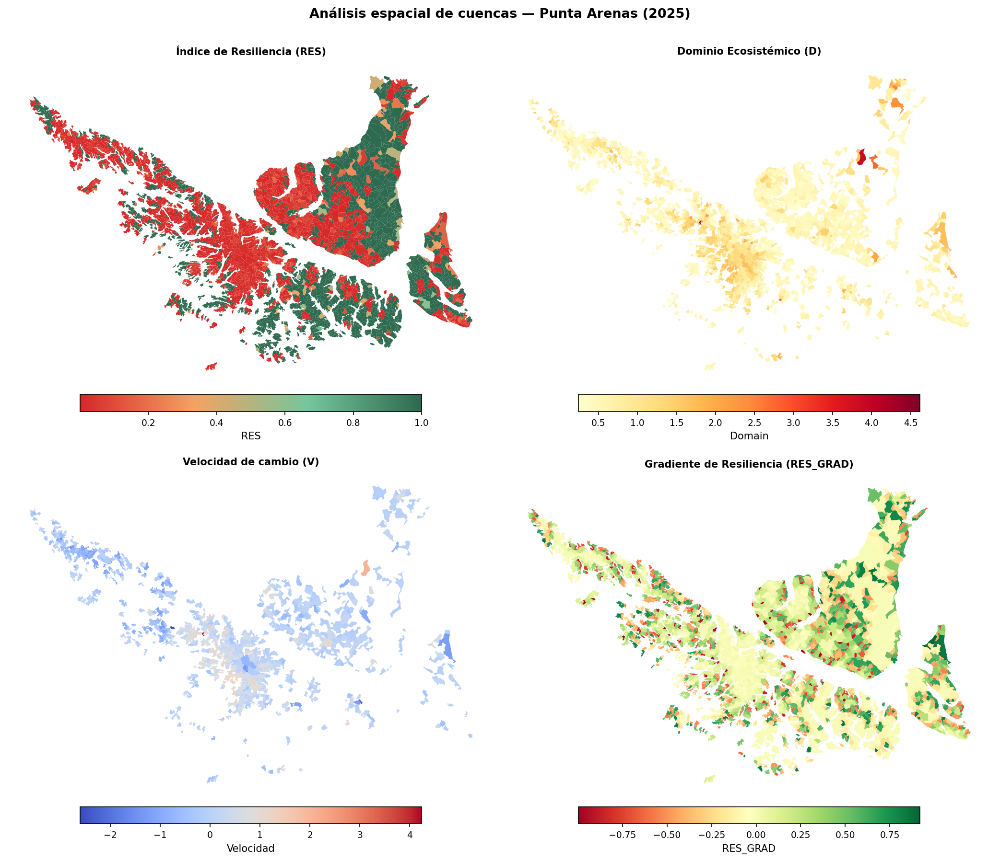{fig-align="center" width="100%"}

:::

::::

::: {.notes}
Cerrar con trazabilidad: cada caso prioritario puede abrirse en D, V, SENS y D_local. La MRCT no reemplaza la validación territorial; permite llegar con mejores preguntas.

:::

# Respaldo técnico

##

### Respaldo A: normalización robusta

:::: {.columns}

::: {.column .p_small width="48%"}
[Por qué normalizar]{.mrct-kicker}

- Las variables quedan en unidades comparables.
- La mediana y MAD reducen influencia de valores extremos.
- El dominio no queda dominado por variables de mayor escala.

:::

::: {.column width="48%"}
$$
\tilde{x} =
\frac{x - \text{med}(x)}
{\text{MAD}(x) \times 1{,}4826}
$$

:::

::::

##

### Respaldo B: parámetros y estados operativos

:::: {.columns}

::: {.column .p_small width="48%"}
[Calibración]{.mrct-kicker}

$$
\alpha = 1{,}0
\qquad
\beta_{local} = 0{,}5
$$

- Son decisiones de calibración operativa.
- Pueden evaluarse con análisis de sensibilidad.

:::

::: {.column .mrct-table width="48%"}
| Condición | Estado |
|---|---|
| `RES > 0,7` | Alta resiliencia |
| `0,4 < RES <= 0,7` | Resiliencia media |
| `0,2 < RES <= 0,4` | Resiliencia baja |
| `RES <= 0,2` | Colapso potencial |

:::

::::
